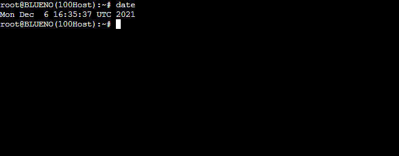
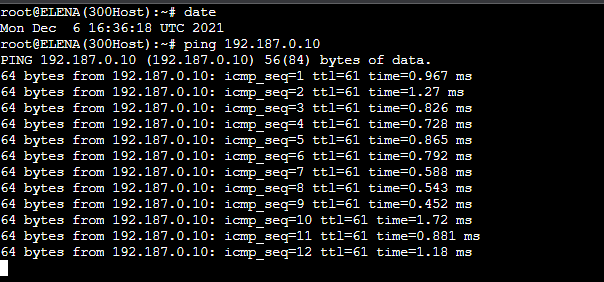
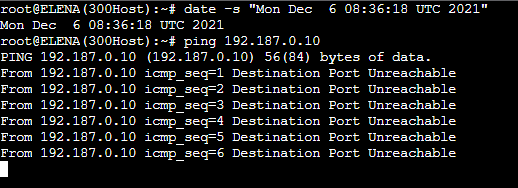
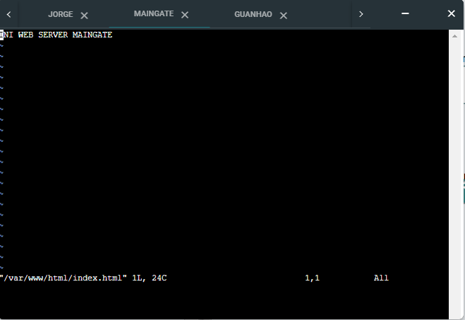
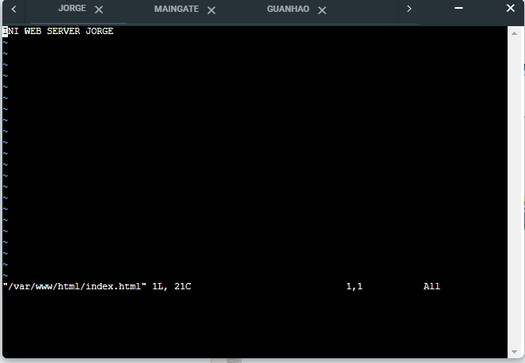
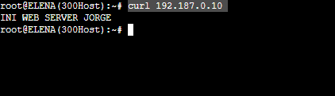
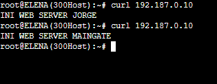
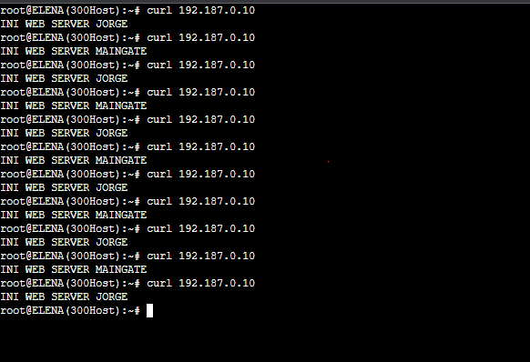

# Jarkom-Modul-5-C07-2021

Kelompok C07

|      NRP       |                  Nama                   |
| :------------: | :-------------------------------------: |
| 05111940000046 |       Titian Pamungkas Anjasmara        |
| 05111940000134 |           Ahmad Lamaul Farid            |
| 05111940000150 | Jonathan Leonardo Hasiholan Simanjuntak |

## Topologi GNS3

Pertama - tama buat topologi pada GNS3 seperti pada gambar berikut :


Keterangan :

- DORIKI adalah DNS Server
- JIPANGU adalah DHCP Server
- MAINGATE dan JORGE adalah Web Server
- Jumlah Host pada BLUENO adalah 100 host
- Jumlah Host pada CIPHER adalah 700 host
- Jumlah Host pada ELENA adalah 300 host
- Jumlah Host pada FUKUROU adalah 200 host

## VLSM

Kemudian bagi topologi yang sudah diberikan ke dalam beberapa subnet kecil sesuai kebutuhan :


Tentukan jumlah IP yang diperlukan beserta dengan netmasknya untuk setiap subnet yang ada :

|  Subnet   | Jumlah IP | Netmask |
| :-------: | :-------: | :-----: |
|    A1     |     3     |   /29   |
|    A2     |    101    |   /25   |
|    A3     |    701    |   /22   |
|    A4     |     2     |   /30   |
|    A5     |     2     |   /30   |
|    A6     |    301    |   /23   |
|    A7     |    201    |   /24   |
|    A8     |     3     |   /29   |
| **Total** | **1314**  | **/21** |

Berdasarkan data tersebut, susun tree subnet VLSM seperti berikut :


Dengan demikian, didapatkan NID untuk masing - masing subnet sebagai berikut :

|  Subnet   | Jumlah IP | Netmask |      NID      |
| :-------: | :-------: | :-----: | :-----------: |
|    A1     |     3     |   /29   |  192.187.0.8  |
|    A2     |    101    |   /25   | 192.187.0.128 |
|    A3     |    701    |   /22   |  192.187.4.0  |
|    A4     |     2     |   /30   |  192.187.0.0  |
|    A5     |     2     |   /30   |  192.187.0.4  |
|    A6     |    301    |   /23   |  192.187.2.0  |
|    A7     |    201    |   /24   |  192.187.0.0  |
|    A8     |     3     |   /29   | 192.187.0.16  |
| **Total** | **1314**  | **/21** |

Masing - masing interface pada sebuah subnet dapat diberikan IP sesuai dengan aturan yang telah diberikan di atas.

- FOOSHA

  

- WATER7

  

- GUANHAO

  

- DORIKI

  

- JIPANGU

  

- JORGE

  

- MAINGATE

  

- BLUENO

  

- CIPHER

  

- ELENA

  

- FUKUROU

  

Setelah itu lakukan routing pada router **FOOSHA** sebagai berikut :


Kemudian pada **WATER7**, **FOOSHA**, **GUANHAO** install **DHCP Relay** dan lakukan perintah `apt-get update` pada ketiga node tersebut.

Setelah itu masukkan syntax `apt-get install isc-dhcp-relay -y`, setelah instalasi selesai, masukkan syntax `vi /etc/default/isc-dhcp-relay`. Sesuaikan `isc-dhcp-relay` seperti pada gambar berikut:


Kemudian lakukan perintah `service isc-dhcp-relay restart` pada 3 node diatas.

Pada **JIPANGU** install **DHCP Server** dan lakukan perintah `apt-get update` pada node tersebut.

Setelah itu masukkan syntax `apt-get install isc-dhcp-server -y`, setelah instalasi selesai, masukkan syntax `vi /etc/default/isc-dhcp-server`. Sesuaikan `isc-dhcp-server` seperti pada gambar berikut:


Edit file pada `vi /etc/dhcp/dhcpd.conf` dan lakukan konfigurasi seperti gambar :


Kemudian lakukan perintah `service isc-dhcp-server restart` pada node diatas.

Tambahkan configurasi pada interfaces setiap klien (BLUENO, CIPHER, ELENA dan FUKUROU):

```
auto eth0
iface eth0 inet dhcp
```

## Soal 1

```
Agar topologi yang kalian buat dapat mengakses keluar, kalian diminta untuk mengkonfigurasi Foosha menggunakan iptables, tetapi Luffy tidak ingin menggunakan MASQUERADE.
```

### Jawaban

Masukkan perintah iptables berikut pada **FOOSHA**

```
iptables -t nat -A POSTROUTING -s 192.187.0.0/21 -o eth0 -j SNAT --to-source 192.168.122.21
```

Untuk testingnya, lakukan `ping google.com` pada node lain. Misalkan disini kami melakukan testing pada node **BLUENO**


## Soal 2

```
Kalian diminta untuk mendrop semua akses HTTP dari luar Topologi kalian pada server yang merupakan DHCP Server dan DNS Server demi menjaga keamanan.
```

### Jawaban

Masukkan perintah iptables berikut pada **WATER7**

```
iptables -A FORWARD -d 192.187.0.8/29 -p tcp --dport 80 -j DROP
```

Untuk testingnya, lakukan perintah `nmap -p 80 192.187.0.10` pada client. Disini kami menggunakan **BLUENO**


Kalau nanti outputnya port 80 `filtered` berarti berhasil `iptables`-nya.

## Soal 3

```
Karena kelompok kalian maksimal terdiri dari 3 orang. Luffy meminta kalian untuk membatasi DHCP dan DNS Server hanya boleh menerima maksimal 3 koneksi ICMP secara bersamaan menggunakan iptables, selebihnya didrop.
```

### Jawaban

Masukkan perintah iptables berikut pada **Doriki dan Jipangu**

```
iptables -A INPUT -p icmp -m connlimit --connlimit-above 3 --connlimit-mask 0 -j DROP
```

### Testing

Lakukan PING pada semua host yang ada secara bersamaan. Host terakhir yang dilakukan ping tidak akan bisa.

### Blueno


### Fukuro


### Elena 


### Ciper


## Soal 4

```
Akses dari subnet Blueno dan Cipher hanya diperbolehkan pada pukul 07.00 - 15.00 pada hari Senin sampai Kamis.
```

Masukkan perintah iptables berikut ke **Doriki**

```
iptables -A INPUT -s 192.187.0.128/25 -m time --timestart 07:00 --timestop 1
iptables -A INPUT -s 192.187.0.128/25 -j REJECT
```

```
iptables -A INPUT -s 192.187.4.0/22 -m time --timestart 07:00 --timestop 15:
iptables -A INPUT -s 192.187.4.0/22 -j REJECT
```

### Testing

Testing dilakukan pada host Blueno dan Ciper dengan melakukan ping ke Doriki, hasilnya tidak akan bisa.


## Soal 5

```
Akses dari subnet Elena dan Fukuro hanya diperbolehkan pada pukul 15.01 hingga pukul 06.59 setiap harinya.
```

### Jawaban

Masukkan perintah - perintah iptables berikut pada **Doriki**

```
iptables -A INPUT -s 192.187.2.0/23 -m time --timestart 15:01 --timestop 23:59 -j ACCEPT
iptables -A INPUT -s 192.187.2.0/23 -m time --timestart 00:00 --timestop 06:59 -j ACCEPT
iptables -A INPUT -s 192.187.2.0/23 -j REJECT
```

### Testing

- Pada salah satu node client yang ada pada soal, pertama - tama periksa dahulu waktu sistem saat ini. Node yang dipilih kali ini adalah Elena.

  ```
  date
  ```

  

- Terlihat bahwa waktu saat ini masuk kedalam jam kerja node Doriki untuk subnet Elena (15:01 - 23:59), sehingga ping berhasil dilakukan. Untuk melakukan ping ke node Doriki, jalankan perintah berikut.

  ```
  ping 192.187.0.10
  ```

  

- Untuk mengetes lebih lanjut, ubah waktu sistem saat ini menjadi diluar waktu kerja node Doriki dengan perintah berikut.

  ```
  date -s "Mon Dec  6 08:36:18 UTC 2021"
  ```

  

- Setelah itu, lakukan ping kembali ke node Doriki. Terlihat bahwa Doriki tidak dapat diakses oleh subnet Elena. Artinya, aturan iptables yang diterapkan sudah sukses.

  

# Soal 6

```
Karena kita memiliki 2 Web Server, Luffy ingin Guanhao disetting sehingga setiap request dari client yang mengakses DNS Server akan didistribusikan secara bergantian pada Jorge dan Maingate.
```

### Jawaban

Masukkan perintah - perintah iptables berikut pada **Guanhao**

```
iptables -A PREROUTING -t nat -d 192.187.0.10 -p tcp -m statistic --mode nth --every 2 --packet 0 -j DNAT --to-destination 192.187.0.18
iptables -A PREROUTING -t nat -d 192.187.0.10 -p tcp -j DNAT --to-destination 192.187.0.19
```

### Testing

- Pertama - tama, pada kedua node web server, yaitu pada _Jipangu_ dan _Maingate_, install service apache dengan menjalankan perintah berikut.

  ```
    apt-get update
    apt-get install apache2 -y
  ```

- Setelah berhasil diinstall, edit file _/var/www/html/index.html_ pada kedua node menjadi seperti pada gamber berikut. (Sesuaikan nama node-nya).

  - Maingate

  

  - Jorge

  

- Kemudian restart service apache pada kedua node web server dengan menggunakan perintah :

  ```
  service apache2 restart
  ```

- Setelah kedua web server berhasil disiapkan, coba akses ke node Doriki (DNS Server) lewat salah satu node yang berhubungan langsung dengan router **Guanhao** (pada kasus ini digunakan node Elena) dengan menggunakan perintah :

  ```
  curl 192.187.0.10
  ```

  

- Terlihat pada percobaan pertama akses ke Doriki (DNS Server), paket dialihkan ke node Web Server Jorge. Coba akses lagi ke node Doriki (DNS Server) dengan menggunakan perintah yang sama dengan yang diatas.

  

- Terlihat bahwa akses ke Doriki sekarang dialihkan ke node Web Server Maingate. Jika dicoba terus menerus akses ke Doriki, maka paket akan terus menerus dialihkan secara bergantian ke Jorge atau Maingate. Dengan begitu, artinya konfigurasi yang diinginkan telah berhasil diterapkan.

  
