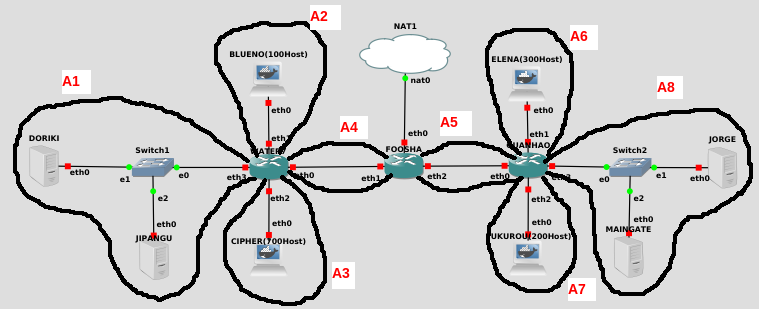
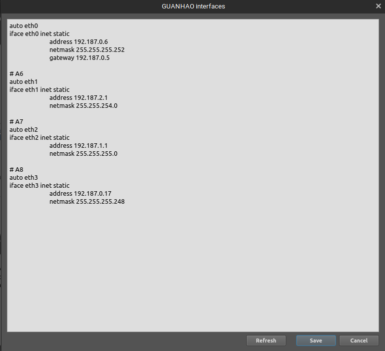
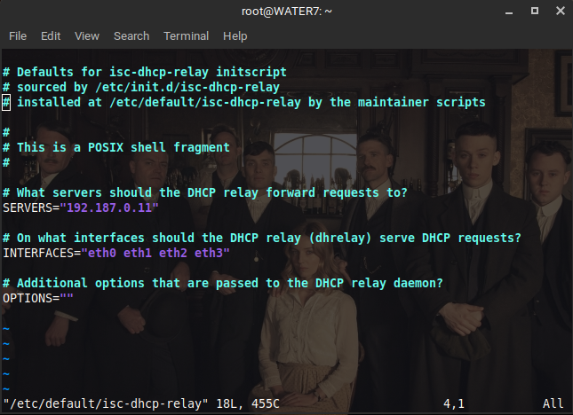

# Jarkom-Modul-5-C07-2021

Kelompok C07

|      NRP       |                  Nama                   |
| :------------: | :-------------------------------------: |
| 05111940000046 |       Titian Pamungkas Anjasmara        |
| 05111940000134 |           Ahmad Lamaul Farid            |
| 05111940000150 | Jonathan Leonardo Hasiholan Simanjuntak |

## Topologi GNS3

Pertama - tama buat topologi pada GNS3 seperti pada gambar berikut :


Keterangan :

-   DORIKI adalah DNS Server
-   JIPANGU adalah DHCP Server
-   MAINGATE dan JORGE adalah Web Server
-   Jumlah Host pada BLUENO adalah 100 host
-   Jumlah Host pada CIPHER adalah 700 host
-   Jumlah Host pada ELENA adalah 300 host
-   Jumlah Host pada FUKUROU adalah 200 host

## VLSM

Kemudian bagi topologi yang sudah diberikan ke dalam beberapa subnet kecil sesuai kebutuhan :



Tentukan jumlah IP yang diperlukan beserta dengan netmasknya untuk setiap subnet yang ada :

|  Subnet   | Jumlah IP | Netmask |
| :-------: | :-------: | :-----: |
|    A1     |     3     |   /29   |
|    A2     |    101    |   /25   |
|    A3     |    701    |   /22   |
|    A4     |     2     |   /30   |
|    A5     |     2     |   /30   |
|    A6     |    301    |   /23   |
|    A7     |    201    |   /24   |
|    A8     |     3     |   /29   |
| **Total** | **1314**  | **/21** |

Berdasarkan data tersebut, susun tree subnet VLSM seperti berikut :


Dengan demikian, didapatkan NID untuk masing - masing subnet sebagai berikut :

|  Subnet   | Jumlah IP | Netmask |      NID      |
| :-------: | :-------: | :-----: | :-----------: |
|    A1     |     3     |   /29   |  192.187.0.8  |
|    A2     |    101    |   /25   | 192.187.0.128 |
|    A3     |    701    |   /22   |  192.187.4.0  |
|    A4     |     2     |   /30   |  192.187.0.0  |
|    A5     |     2     |   /30   |  192.187.0.4  |
|    A6     |    301    |   /23   |  192.187.2.0  |
|    A7     |    201    |   /24   |  192.187.0.0  |
|    A8     |     3     |   /29   | 192.187.0.16  |
| **Total** | **1314**  | **/21** |

Masing - masing interface pada sebuah subnet dapat diberikan IP sesuai dengan aturan yang telah diberikan di atas.

-   FOOSHA

    

-   WATER7

    

-   GUANHAO

    

-   DORIKI

    

-   JIPANGU

    

-   JORGE

    

-   MAINGATE

    

-   BLUENO

    

-   CIPHER

    

-   ELENA

    

-   FUKUROU

    

Setelah itu lakukan routing pada router **FOOSHA** sebagai berikut :


Kemudian pada **WATER7**, **FOOSHA**, **GUANHAO** install **DHCP Relay** dan lakukan perintah `apt-get update` pada ketiga node tersebut.

Setelah itu masukkan syntax `apt-get install isc-dhcp-relay -y`, setelah instalasi selesai, masukkan syntax `vi /etc/default/isc-dhcp-relay`. Sesuaikan `isc-dhcp-relay` seperti pada gambar berikut:




Kemudian lakukan perintah `service isc-dhcp-relay restart` pada 3 node diatas.

Pada **JIPANGU** install **DHCP Server** dan lakukan perintah `apt-get update` pada node tersebut.

Setelah itu masukkan syntax `apt-get install isc-dhcp-server -y`, setelah instalasi selesai, masukkan syntax `vi /etc/default/isc-dhcp-server`. Sesuaikan `isc-dhcp-server` seperti pada gambar berikut:


Edit file pada `vi /etc/dhcp/dhcpd.conf` dan lakukan konfigurasi seperti gambar :


Kemudian lakukan perintah `service isc-dhcp-server restart` pada node diatas.

Tambahkan configurasi pada interfaces setiap klien (BLUENO, CIPHER, ELENA dan FUKUROU):

```
auto eth0
iface eth0 inet dhcp
```

## Soal 1

```
Agar topologi yang kalian buat dapat mengakses keluar, kalian diminta untuk mengkonfigurasi Foosha menggunakan iptables, tetapi Luffy tidak ingin menggunakan MASQUERADE.
```

### Jawaban

Masukkan perintah iptables berikut pada **FOOSHA**

```
iptables -t nat -A POSTROUTING -s 192.187.0.0/21 -o eth0 -j SNAT --to-source 192.168.122.21
```

Untuk testingnya, lakukan `ping google.com` pada node lain. Misalkan disini kami melakukan testing pada node **BLUENO**


## Soal 2

```
Kalian diminta untuk mendrop semua akses HTTP dari luar Topologi kalian pada server yang merupakan DHCP Server dan DNS Server demi menjaga keamanan.
```

### Jawaban

Masukkan perintah iptables berikut pada **WATER7**

```
iptables -A FORWARD -d 192.187.0.8/29 -p tcp --dport 80 -j DROP
```

Untuk testingnya, lakukan perintah `nmap -p 80 192.187.0.10` pada client. Disini kami menggunakan **BLUENO**


Kalau nanti outputnya port 80 `filtered` berarti berhasil `iptables`-nya.
